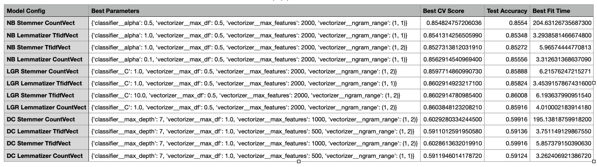
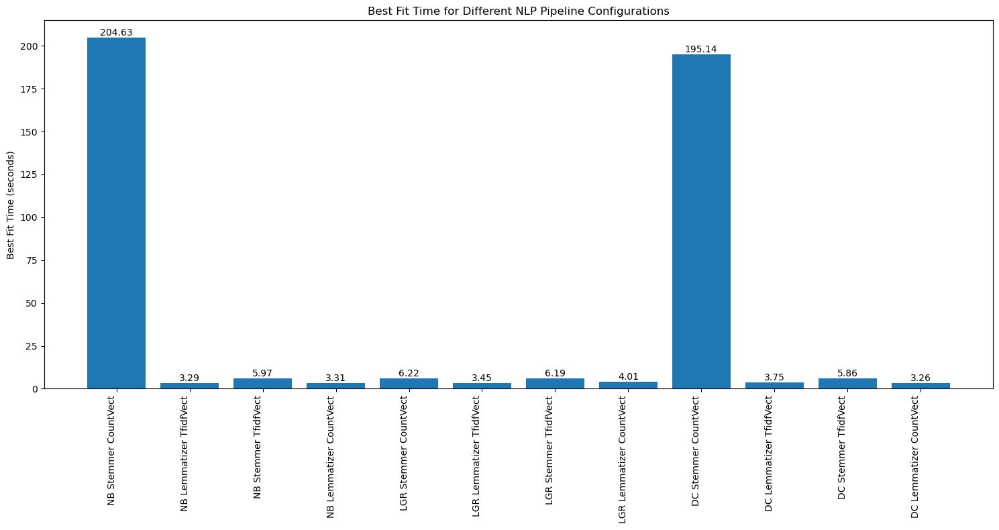
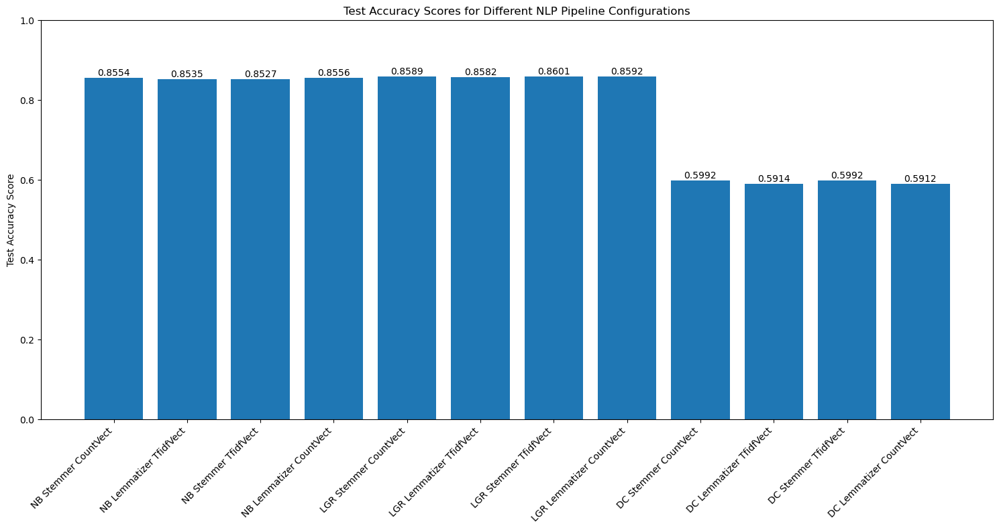

# NLP Primer with Humor Detection in Texts

## **Objective**

This mini-project aims to evaluate the effectiveness of different text preprocessing and vectorization techniques in conjunction with three classification models—Naïve Bayes, Logistic Regression, and Decision Trees—for the task of humor classification in text. Using the [ColBERT dataset from Kaggle](https://www.kaggle.com/datasets/deepcontractor/200k-short-texts-for-humor-detection), this project will explore various approaches with text pre-processing and feature extraction with classification models, serving as an introductory exploration into the rich field of Natural Language Processing (NLP).

## **Goal**

Identify the most effective combination of text preprocessing steps, vectorization methods, and classifiers for classifying humor in textual data. The project seeks to enhance understanding of how different NLP techniques influence model performance, providing foundational insights into text classification and sentiment analysis.

## **Summary**

-   Evaluated text preprocessing - Stemming and Lemmatization, and feature Vectorization techniques – Count and TFIDF vectorizer, with 3 Classifiers – Multinomial Naive Bayes (NB), Logistic Regression (LGR) and Decision Tree (DC)

-   Resulted in 12 different combinations with the pipeline used in GridSearch

-   Compared model performance in terms of accuracy (accuracy score) and speed (best fit training times in seconds)

-   Comparing best fit training time

-   Comparing classifier accuracy scores with test dataset (Train/Test split 75/25)

## **Conclusion**

-   The Naive Bayes classifier using stemming and count vectorization had the longest training time, followed by the Decision Tree model with the same preprocessing setup.

    -   The best-performing model was the Logistic Regression classifier with stemming and TF-IDF vectorization, achieving an accuracy score of 0.86 and a training time of 6.19 seconds.

    -   Naive Bayes models that used lemmatization and TF-IDF vectorization showed shorter training times compared to Logistic Regression models, while still maintaining a similar performance level, with an accuracy of 0.85.

    -   Decision Tree models underperformed in comparison to both Logistic Regression and Naive Bayes classifiers in terms of accuracy.

## **Colbert Dataset Humor Classification: The Winning Formula**

For top-notch accuracy, go with a Logistic Regression classifier using stemming and TF-IDF vectorization—it scores a solid 0.86 accuracy in just 6.19 seconds!

But if you're looking to strike the perfect balance between speed and performance, the Naive Bayes classifier with lemmatization and count vectorization is your best bet, delivering a nearly perfect 0.8556 accuracy in just 3.31 seconds.
